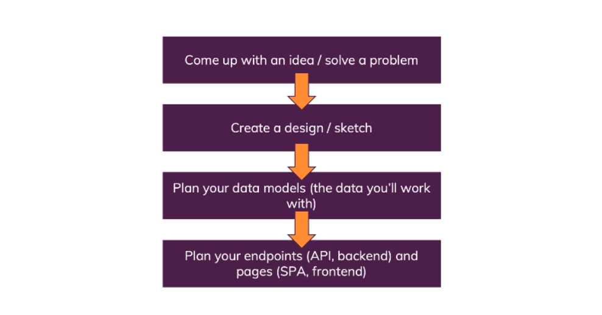

# The MERN Fullstack Guide

- [What is MERN?](#1)
- [Planning the App](#2)
- [Node.js & Express.js](#3)
- [MongoDB & Mongoose](#4)

---

## 📒 What is MERN? <a name="1"></a>


### 1. Frontend


### 2. Backend


Backend: Node + Express REST API


REST & HTTP Methods


GraphQL


REST vs GraphQL


The `REST API` approach uses HTTP method combination to identify resources or actions on a server and that's very intuitive and very easy to learn.
Such an API is stateless and decoupled from any frontend, which means a REST API you build cannot just be used with your React single page application, any client could talk to it. So if you later build a mobile application with iOS or Android, you could talk to that same API because the API is totally separated from the frontend which is the cool thing about this API approach, you can reuse the API and just attach different frontends, one of the reasons why such APIs are so popular these days.

A `GraphQL API` does not use the path HTTP method but instead such a query expression using a certain query language to identify a resource in action and just like the REST API, it's also stateless and decoupled. So just as with the REST API, you can attach any client to that API which is great but the reason why we won't use it is that despite GraphQL being very popular and very useful and powerful, you need to learn that extra query language which is some extra effort and which not everyone wants to do.

### 3. Two Ways of Connecting Node + React


---

## 📒 Planning the App <a name="2"></a>



---

## 📒 Node.js & Express.js <a name="3"></a>

`Node.js`, is a Javascript engine originally built for the browser, now working without a browser and enriched with some extra APIs. With Node.js, we can write any kind of application, any kind of script with Javascript. One popular use case of Node.js is to use it to build web servers which handle incoming requests, maybe talk to databases and also send back responses.

```javascript
// server creation with Node.js - not the ideal solution

const http = require("http"); // this modle allows to create server. It has a createServer method which takes as argument the request listener (a function which is triggered whenever we have an incoming request). This gets two arguments: a request and a response object.

const server = http.createServer((req, res) => {
  console.log("INCOMING REQUEST");
  console.log(req.method, req.url);

  if (req.method === "POST") {
    // check if request method is equal to POST which means the form was submitted

    let body = "";

    // function which is executed once the entire request has arrived
    req.on("end", () => {
      const userName = body.split("=")[1];
      res.end("<h1>" + userName + "</h1>");
    });
    // event listener for the data event
    // data is actually streamed into this server in chunks
    req.on("data", (chunk) => {
      body += chunk;
    });
  } else {
    // if we're not getting a POST request, then we want to return this content
    res.setHeader("Content-Type", "text/html"); // This tells the browser that what is been sending back should not be interpreted as something special but as plain text.

    res.end(
      '<form method="POST"><input type="text" name="username"><button type="submit">Create User</button></form>'
    ); // for sending back a response, can be used end method which meanes that response is ready to be send back.
  }
});

server.listen(5000); // method listen  will setup an event listener for incoming requests
```

`Express.js` is a framework for Node.js and makes certain things easier. One thing that is specific to Express is that it's middleware focused.

```javascript
// server creation with Express.js
const express = require("express");

const app = express(); // call Express as a function and store the result

app.use((req, res, next) => {
  let body = "";
  req.on("end", () => {
    const userName = body.split("=")[1];
    if (userName) {
      req.body = { name: userName };
    }
    next(); // next function which you call if you don't want to send the response in this middleware but instead you want to forward the request to the next middleware in line. If you're not calling next, then any middleware after this middleware, if we had more than one, will not be reached by this request.
  });
  req.on("data", (chunk) => {
    body += chunk;
  });
});

app.use((req, res, next) => {
  if (req.body) {
    return res.send("<h1>" + req.body.name + "</h1>");
  }
  res.send(
    '<form method="POST"><input type="text" name="username"><button type="submit">Create User</button></form>'
  );
});

app.listen(5000);
```

We able to parse the incoming requests in a more comfortable way that we don't have to manually parse it. For this we use a `body-parser`. Body parser gives us ready-to-use middlewares. It allows us to get rid of all that code in our first middleware and instead of writing our own function, we can write BodyParser.json

```javascript
// server creation with Express.js and BodyParser
const express = require("express");
const bodyParser = require("body-parser");

const app = express();

app.use(bodyParser.urlencoded({ extended: false }));

app.post("/user", (req, res, next) => {
  res.send("<h1>User: " + req.body.username + "</h1>");
}); // Use post which allows to register a middleware which only triggers on incoming post requests, so where the HTTP verb is post.

app.get("/", (req, res, next) => {
  res.send(
    '<form action="/user" method="POST"><input type="text" name="username"><button type="submit">Create User</button></form>'
  );
});

app.listen(5000);
```

## 📒 MongoDB & Mongoose <a name="4"></a>

```

```
